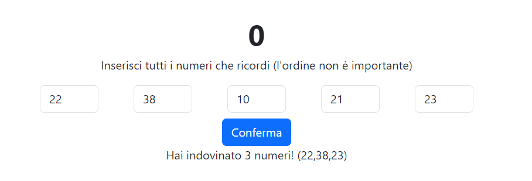

# Simon Says

## Descrizione:
Visualizzare in pagina 5 numeri casuali. Da lì parte un timer di 30 secondi.
Dopo 30 secondi i numeri scompaiono e appaiono invece 5 input in cui l'utente deve inserire i numeri che ha visto precedentemente, nell'ordine che preferisce.
Dopo che sono stati inseriti i 5 numeri, il software dice quanti e quali dei numeri da indovinare sono stati individuati.

### NOTA:
Non è importante l'ordine con cui l'utente inserisce i numeri, basta che ne indovini il più possibile.
Potete implementare il countdown con setTimeout, ma meglio se con setInterval per mostrare il tempo rimasto all'utente in pagina :occhiolino:
Non vi preoccupate per eventuali numeri ripetuti.

### BONUS:
- Inseriamo la validazione: se l'utente inserisce cose diverse da numeri lo blocchiamo in qualche modo.
- Se l’utente ha inserito qualcosa di non valido, segnaliamolo visivamente nel form.

### Consigli del giorno:
- Pensate prima in italiano.
- Dividete in piccoli problemi la consegna.
- Individuate gli elementi di cui avete bisogno per realizzare il programma.
- Immaginate la logica come fosse uno snack: "Dati 2 array di numeri, indica quali e quanti numeri ci sono in comune tra i due array"

### Risultato finale

## Ragionamento logico
1. Generare 5 numeri casuali in un range tra 1 e 99 e renderli visibili in pagina;
2. Impostare un timer di 30 secondi, al termine del quale i numeri spariranno e verranno sostituiti da 5 caselle vuote di input nel quale l'utente dovrà inserire i numeri da indovinare;
3. Verificare che l'utente abbia inserito effettivamente dei numeri e, se non lo ha fatto bloccare l'esecuzione e far apparire un alert; 
4. Dopo aver convalidato i numeri dell'utente, attraverso un algoritmo di confronto tra i numeri verifica se e quanti numeri ha indovinato l'utente.

## Output
Stampare a schermo quanti numeri sono stati indovinati e quali, inserendo una frase adeguata.